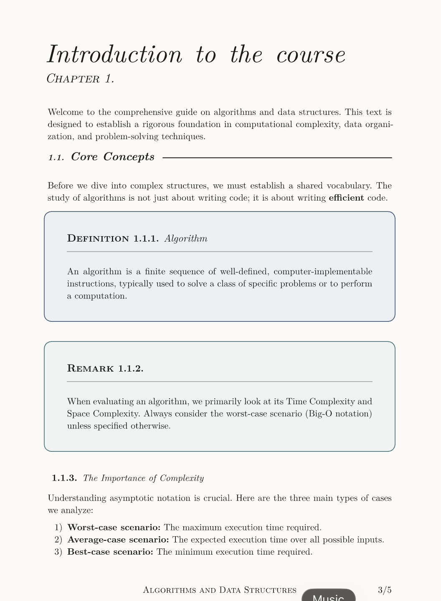

# Adversa Notes

**Adversa** is a [Typst](https://typst.app) template intended for taking course notes, designed with STEM-related subjects in mind, mainly mathematics and computer science. The inspiration and reason for its purpose comes from other typst templates such as `minimal-notes` and `mousse-notes` lacking certain features that I found necessary, thus this template is a tweaked mash up of them.

_dummy page preview_



## Installation
To start using the template, you must first install it locally to your `typst/packages/local/` directory. To make this process as seamless as possible you can use [typship](https://github.com/sjfhsjfh/typship) tool for typst package management and run the following command in your CLI.
```bash
typship download https://github.com/maciejzujtu/adversa
```
After successful installation you can view a dummy page by creating a directory that has few dummy files to showcase functions that this template has to offer. To download the template simply run:
```bash
typst init @local/adversa <path>
```
I'm planning to submit a fork request to `typst/packages` repository in order to hopefully have this template added onto the `@preview` namespace. For now though it's only accessible by locally installing it on your device.

Will do in due time once I think it's good enough.

## Documentation
To add the template to your typst notes simply include the import statement as well as `adversa` function with few arguments named as follows:

- `title`  (_optional_) -  The paper's title page located at the very top of the title page,
- `subtitle` (_optional_) - The paper's subtitle page located right under `title`, 
- `author` (_optional_) -  The paper's author located at the bottom of title page,
- `show-date` (_optional_) - Current date located under the `author` field.

**REMARK**.
It's worth noting that this template uses [codly](https://typst.app/universe/package/codly) package to highlight code snippets via the `#code` block. So if you are planning on adding any code snippets to your typst files whilst you use this template make sure to also add the commented out `show` rules.

```typ
#import "@local/adversa:0.1.1": *

#show: adversa.with(
  title: [Algorithms and Data Structures],
  subtitle: [Comprehensive set of notes],
  outline-title: [Contents],
  author: "Dummy",
  show-date: true
)

// #show: codly-init                    <- Code snippets
// #codly(languages: codly-languages)   <- Icons pack
```

After including the following rules as well as imports the title page will look like the one below.

_dummy title preview_


## Further implementations

- Adhere to SemVer versioning convention
- Fork it eventually for typst
